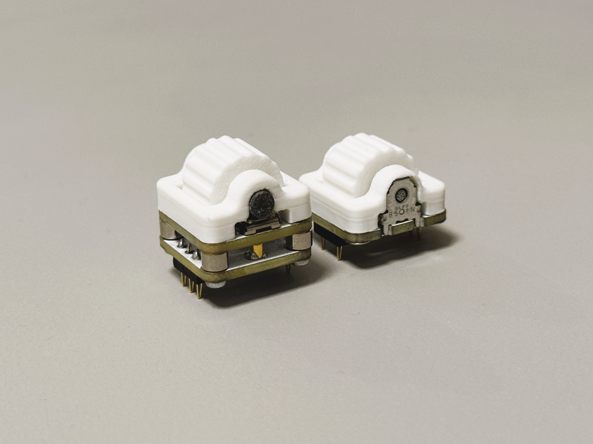
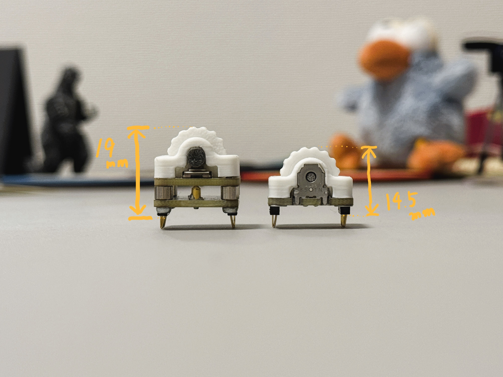
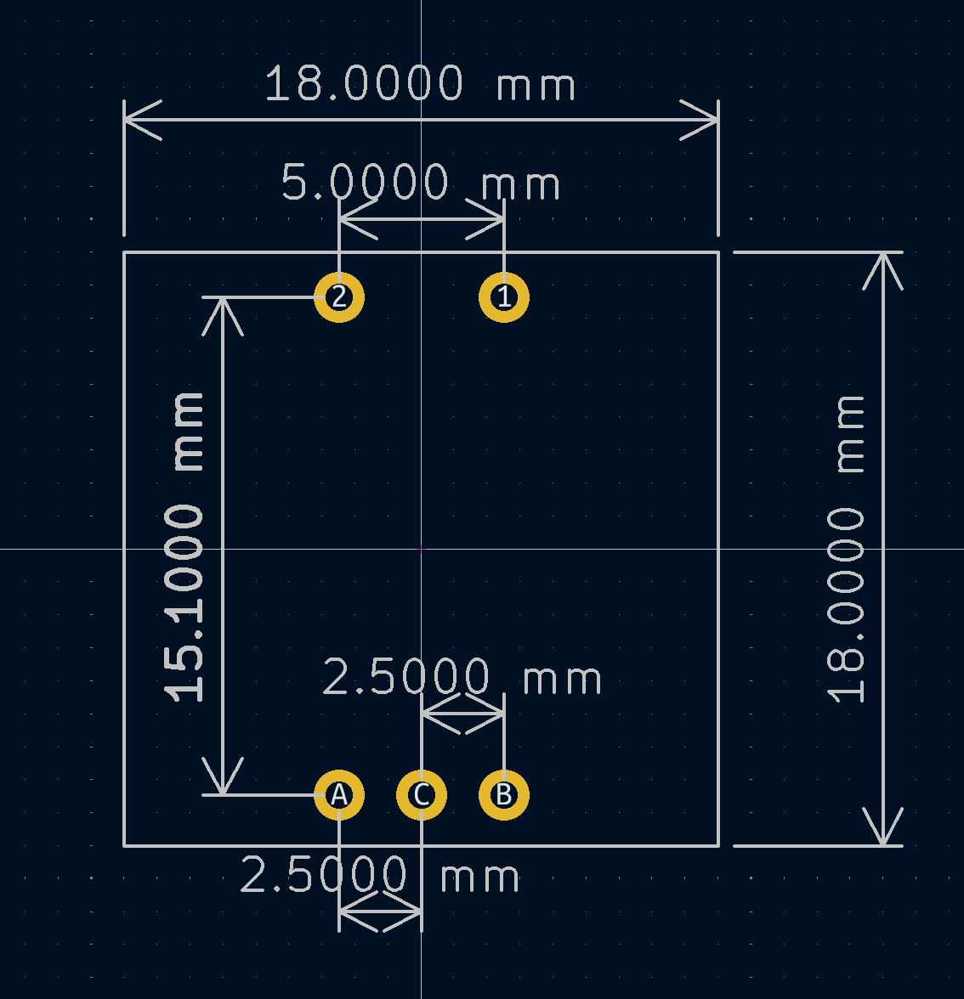

# CKW12
CKW12はクリックあり1U水平ロータリエンコーダです  
+ EC12に極力寄せたフットプリント
+ 通常プロファイル、ロープロファイルいずれの高さにも調整可能

## Whare to Buy

[BOOTH](https://kumamuk.booth.pm/items/6771437)にて組み立てキットが購入可能

## Build Guide

ビルドガイドは[こちら](https://github.com/kumamuk-git/CKW12/blob/main/doc/buildguide.md)

  
  

