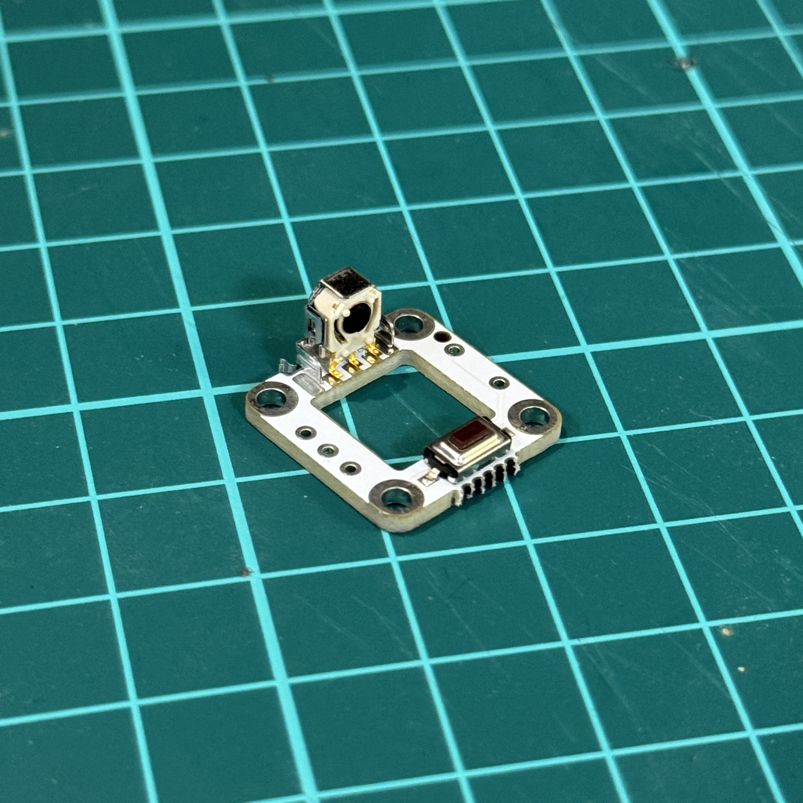
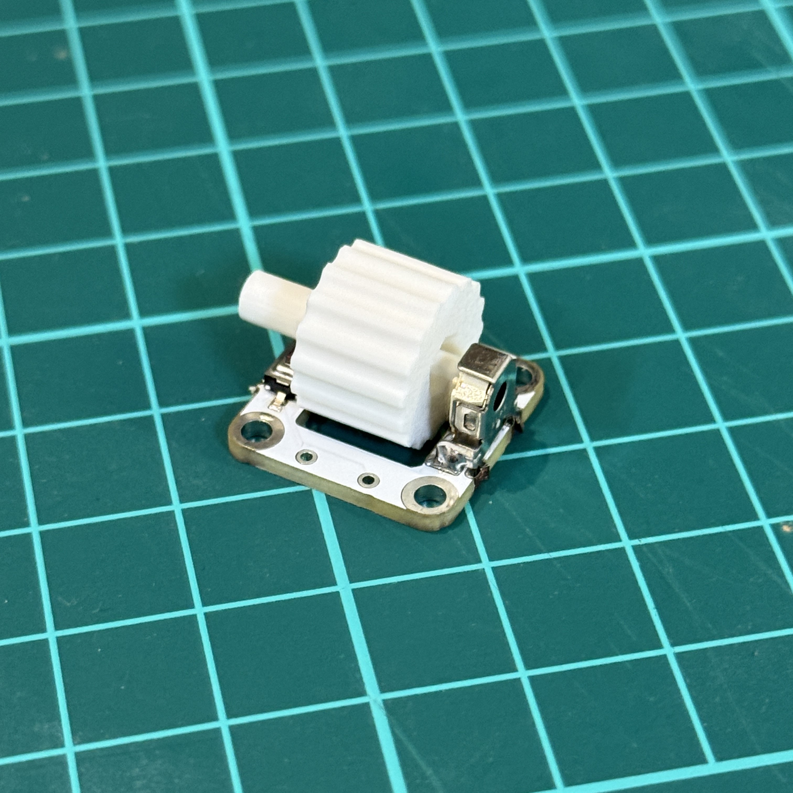
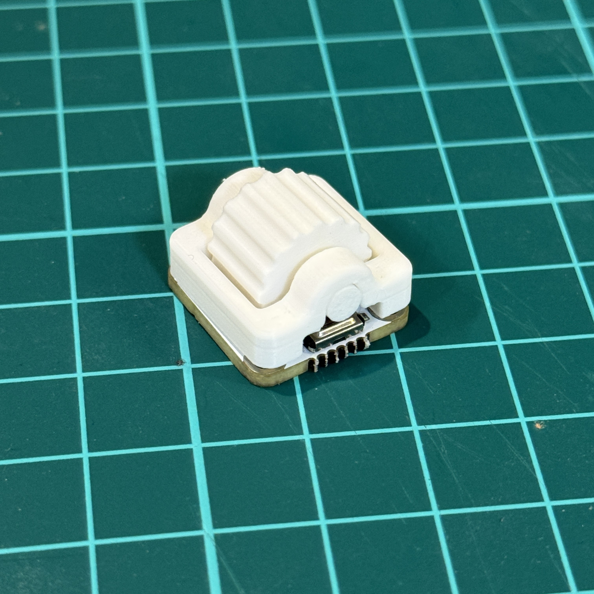
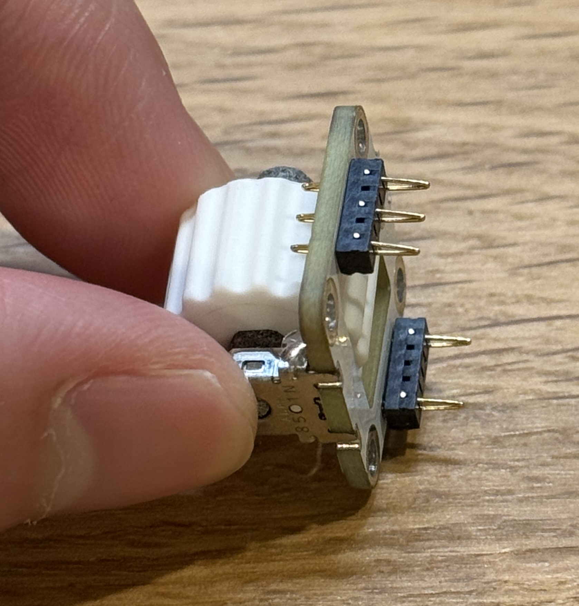
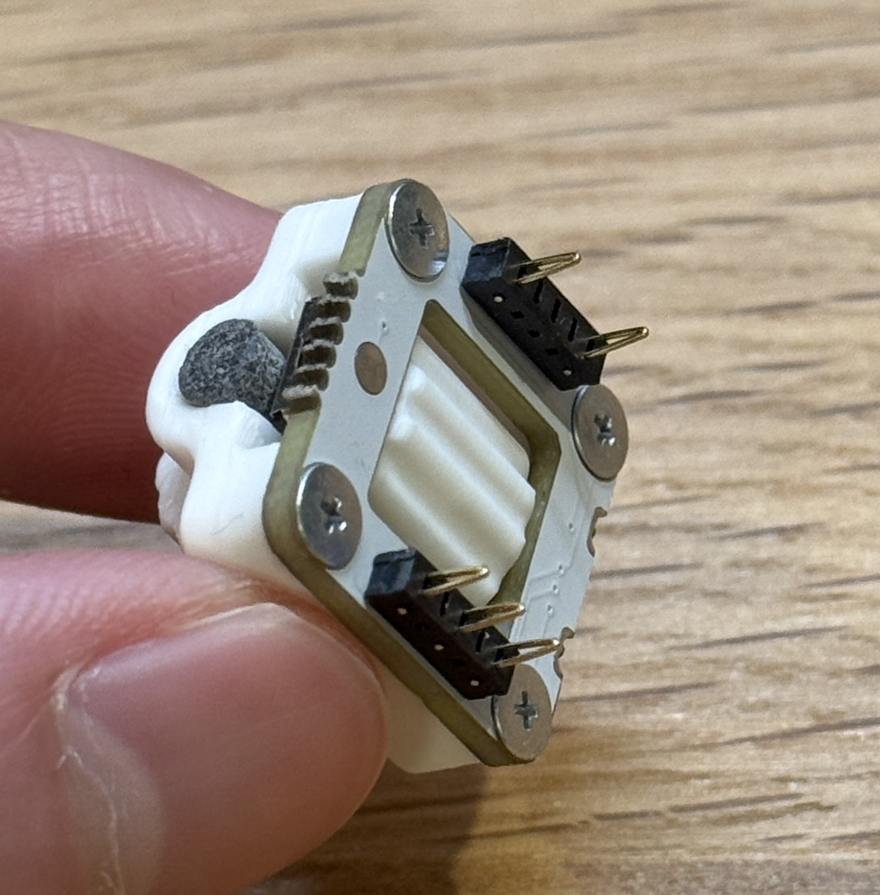
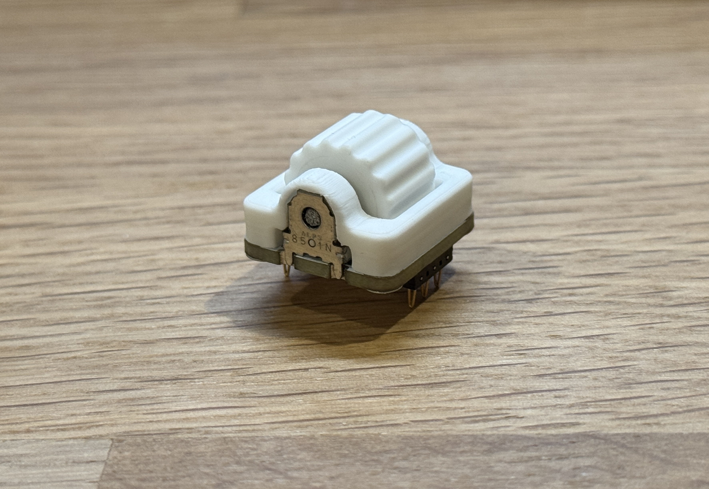
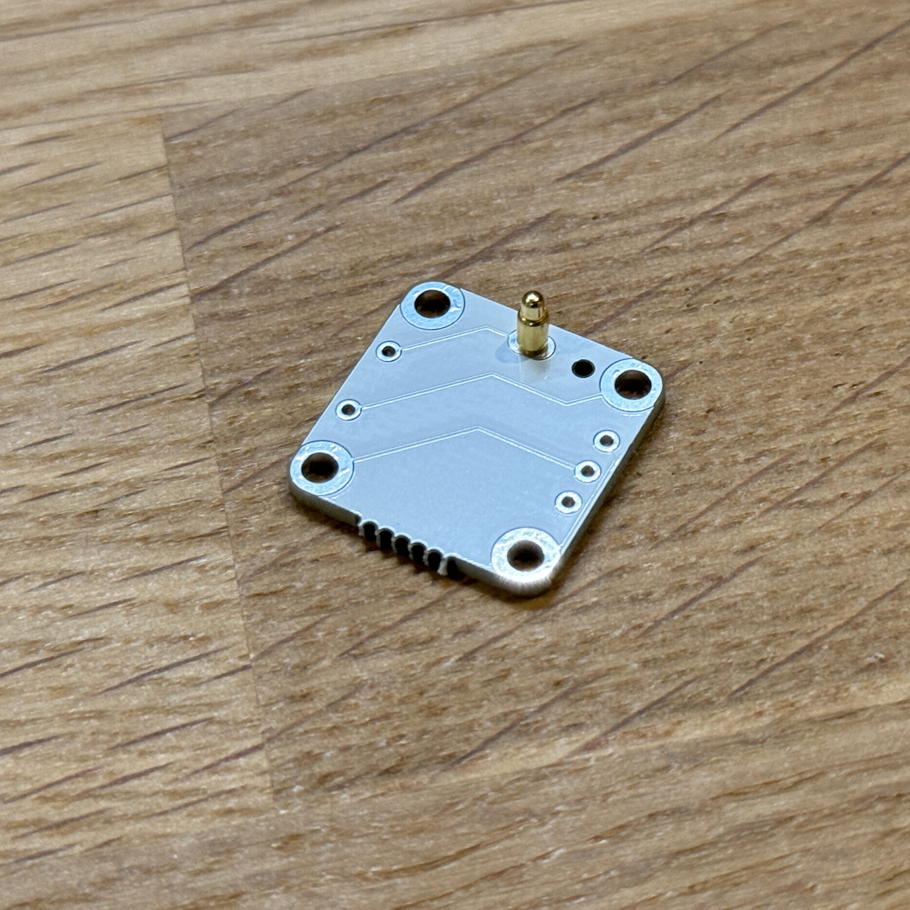
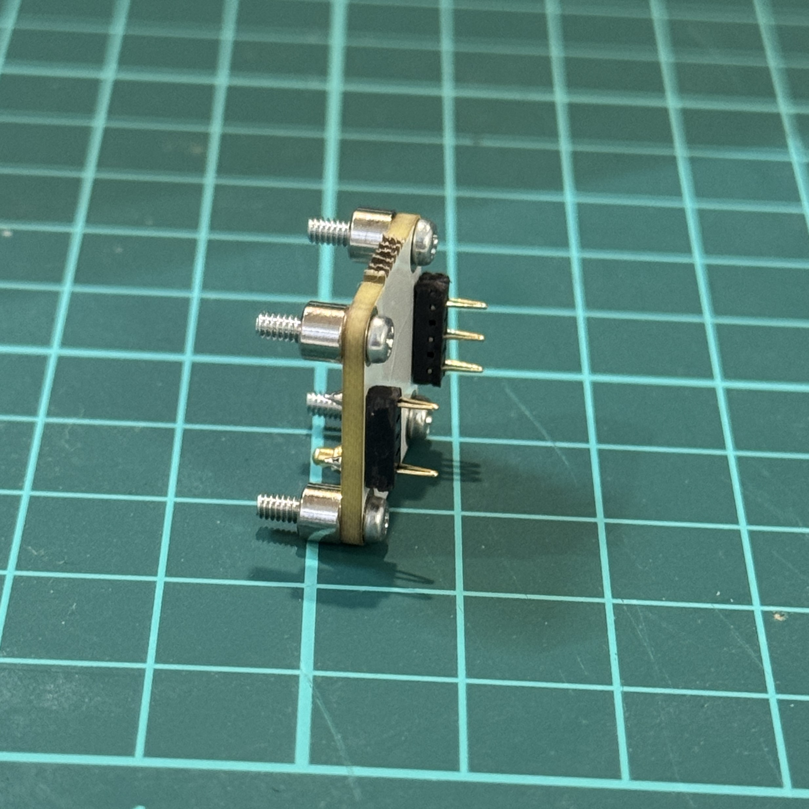
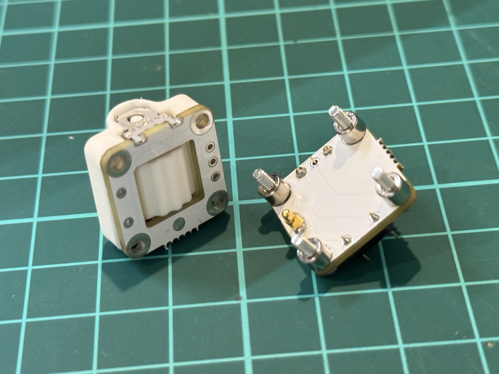
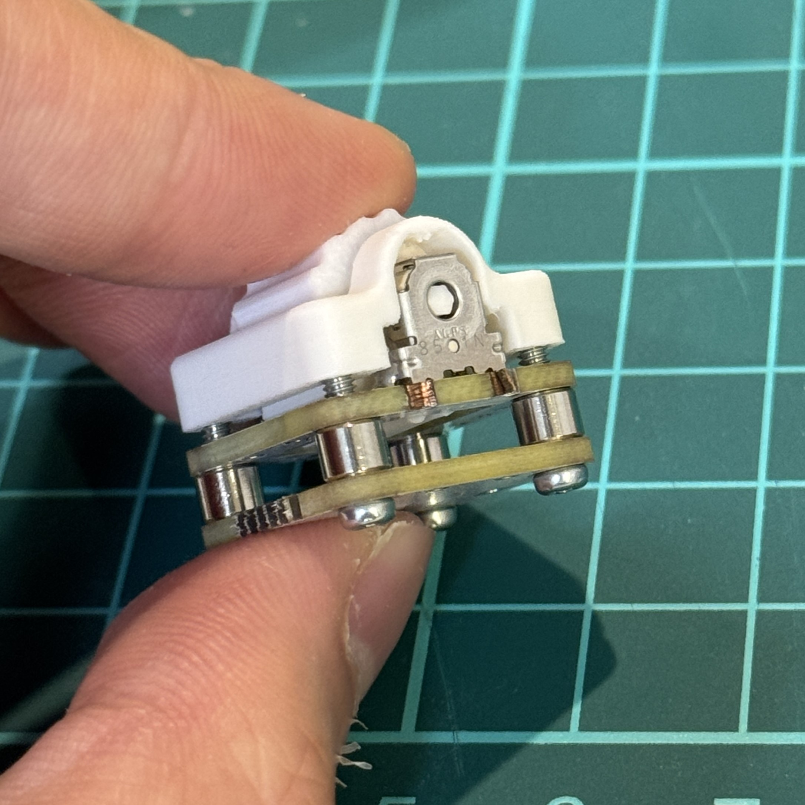

# CKW12の組み立て  

LP版では一部部品が不要です。

## 必要部品
| 名前 | 数 | 備考 |
|:-|---:|:-|
| ハウジング         | 1個 ||
| ホイール        | 1個 | 3Dプリント品|
| ステム        | 1個 | 3Dプリント品|
| EC05E1220202          | 1個 | |
| コンスルーピン(3ピン)         | 2個 |うち1つは中央のピンが不必要のため取り外しています |
| CKW12_top基板      | 1枚 | |
| ネジ M2 3.5mm or 8mm                 | 4本 |  LP版...3.5mm 通常版...8mm　|
| CKW12_bottom基板      | 1枚 |LP版では不要|
| スペーサー M2 3mm             | 4本 |LP版では不要 |
| スプリングピン(ポゴピン)      | 1本 | LP版では不要|

## 組み立て手順

### 目次
  - [1. top基板（共通）](#1-上部基板共通)
    - [1-1. コンスルー取付（LP版のみ）](#1-1-コンスルー取付lp版のみ)
  - [2. bottom基板（LP版不要）](#2-bottom基板lp版不要)

  

### 1. top基板（共通）

写真のようにtop基板にロータリーエンコーダ(EC05E1220202 )を置き、はんだで固定します。  
エンコーダ側面からはんだ付けすると楽かと思います。  
***端子部分ははんだ不良が起きやすいので、端子を小手でパッド側に押し付けつつ温めてはんだを流し込むようにすると良さそうです。***  
なのでここも細かい小手先がいいですね。  
エンコーダが動かない場合の原因は十中八九これです。  
きれいにはんだ出来ているように見えてもここを疑ってください。

エンコーダにホイールとステムを取り付けます。  
まず、ホイールを置き、そしてスイッチ側からホイールの穴を通す形でステムを入れ込み、
ステムの先端をロータリーエンコーダに差し込んでください。  
ここで無理に押し込むとステムが折れてしまいます。  
***ステムの先端と、エンコーダーの穴がそれぞれ六角形になっているので、向きが合うのを確認してから慎重に差し込んでください。***

そして上からハウジングをかぶせます。
ハウジングの細かいサポート材が取り切れていないときれいに嵌らない場合があるので、もし取り残しがあればピンセットなどで取り除いてください。  

 

#### 1-1. コンスルー取付（LP版のみ）

LP版の場合はこの時点でコンスルーを取り付けてください。  
ハウジングかぶせてからでも可。  
※デカ指失礼
  

そしてM2ネジ3.5mmでハウジングを固定してください。  
※デカ指失礼2  

LP版は異常で組み立て完了です。  

  

### 2. bottom基板（LP版不要）

bottom基板（中央に穴のないほう）にポゴピンを1本付けます。  
分かりづらいですが、切り離す前に部品がついていたほうが表になります。  
表面に対して、上からポゴピンを差し込みます。
マステ等で固定して、裏からはんだ付けがいいかな思います。  

***↓これが表面です。***

続いて裏面から8mmのネジで3mmスペーサーを固定します。  
このスペーサーが上下基板を繋ぐ導体になります。
そして写真のようにコンスルーを取り付けます。  

上下を取り付けます。
タクトスイッチ裏のパッドにポゴピンが当たるような向きにして、ネジをハウジングに差し込み固定してください。  
この際に固定が緩いと上下の基板の接続不良となってしまうため、しっかりと固定してください。

  
↑隙間がなくなるまでネジを締めてください。

以上で組み立て完了です。  
コンスルーを基板に差し込み取り付けてください。
なお、コンスルーの差し込みのみでの固定なので若干ぐらつきがあります。  
気になる場合は交換不可になりますが、基板にはんだで固定してしまってもよいかもしれません。